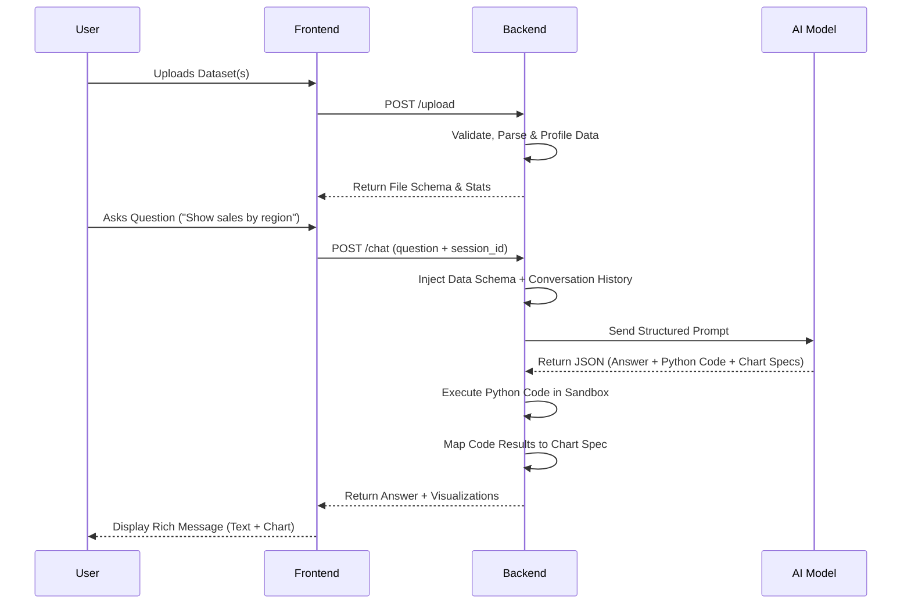

# AI Data Analyst 🤖📊

An AI-powered data analysis platform. Upload CSV files and interact with your data using natural language — get insights, visualizations, anomaly detection, and SQL/Pandas code generation powered by an LLM.

---

## Features

| Feature | Details |
|---|---|
| **CSV Upload** | Drag-and-drop, multiple files, up to 50 MB each |
| **Natural Language Q&A** | Ask questions in plain English, get answers with reasoning |
| **Code Generation** | Pandas + SQL generated automatically |
| **Code Execution** | Code runs in a safe sandbox — real computed results |
| **Charts** | Bar, Line, Area, Pie, Scatter — rendered dynamically with Plotly |
| **Anomaly Detection** | Isolation Forest + LLM explanation per flagged row |
| **AI Insights** | 5-8 business insights with severity & category |
| **Data Quality** | Missing values, duplicates, outliers, score 0–100 |
| **Conversation Memory** | Last N turns kept in LLM context |
| **Export Report** | Download full session as JSON |
| **Multi-file Analysis** | Multiple CSVs per session |
| **Session Management** | UUID sessions, file removal, session reset |

---

## Architecture Diagram

The application leverages a modern web stack backed by Supabase for persistent data storage and Google Gemini for Large Language Model processing.

```mermaid
graph TD
    User([User])
    
    subgraph Frontend [Frontend (React + Vite + Zustand)]
        UI[Web Interface]
        State[Zustand State Management]
    end

    subgraph Backend [Backend (FastAPI + Python 3.11)]
        API[API Endpoints]
        LLM_Service[Chat & Code Service]
        Data_Service[Data Quality & Anomaly Service]
        Storage_Service[Session & File Storage]
    end

    subgraph External [External Services]
        LLM[Google Gemini / OpenAI LLM]
        DB[(Supabase PostgreSQL)]
    end

    User -->|Uploads CSV / Asks Qs| UI
    UI <--> State
    State <-->|HTTP Requests| API
    
    API --> LLM_Service
    API --> Data_Service
    API --> Storage_Service
    
    LLM_Service <-->|Prompts & Context| LLM
    Storage_Service <-->|CRUD Sessions & Files| DB
    Data_Service -->|Calculations| Storage_Service
```

---

## Architecture Diagram (High-Level)


---

## Workflow Diagram

Below is the step-by-step workflow of how data moves through the AI Data Analyst platform:



*(You can also refer to the included for an alternative visual representation).*


---

## Quick Start (Docker) - Recommended

The easiest way to run the application is using Docker Compose. Ensure you have Docker installed and running.

1. **Configure Environment Variables**:
   Copy the example file and add your Supabase credentials and Gemini/OpenAI API Keys.
   ```bash
   cp backend/.env.example backend/.env
   # Edit backend/.env with your credentials
   ```

2. **Run Docker Compose** from the root directory:
   ```bash
   docker compose up --build -d
   ```

3. **Access the Application**:
   - **Frontend**: http://localhost (port 80)
   - **Backend API Docs**: http://localhost:8000/docs

---

## Quick Start (Manual)

If you prefer to run the services directly on your host machine:

### 1. Backend

```bash
cd backend

# Create virtual environment
python -m venv .venv
.venv\Scripts\activate          # Windows
# source .venv/bin/activate     # Mac/Linux

# Install dependencies
pip install -r requirements.txt

# Configure environment
cp .env.example .env
# Edit .env and set your credentials (GEMINI_API_KEY, Supabase URL/Key, etc.)

# Run server
python main.py
# → http://localhost:8000
# → Swagger docs at http://localhost:8000/docs
```

### 2. Frontend

```bash
cd frontend

# Install dependencies
npm install

# Configure environment
cp .env.example .env   # uses http://localhost:8000 by default

# Run dev server
npm run dev
# → http://localhost:5173
```

---

## Sample Datasets

You can use the datasets located in the `Sample Datasets/` directory (such as `Hb_PPG_7-17gdl.csv`) to immediately test the platform's analytical capabilities, charts, and anomaly detection. 
